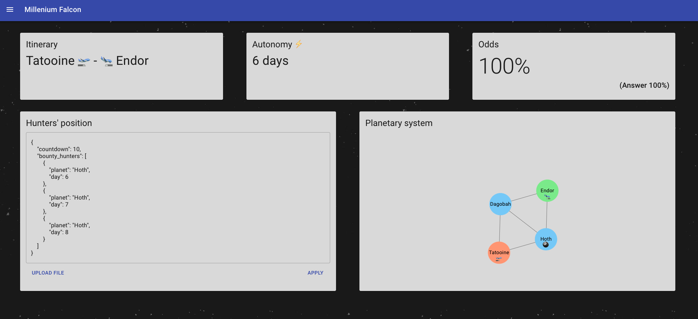
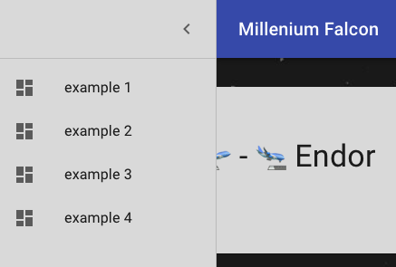
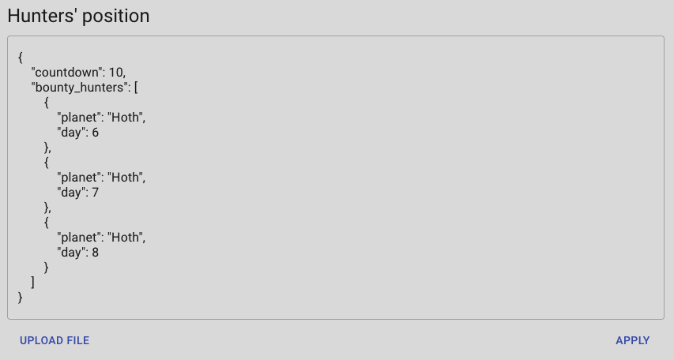
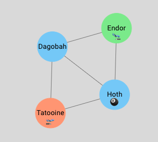

# Falcon 🦅

### Installation

- packages: `yarn`
- Backend: `yarn server`: this will start the server on http://localhost:8080
- Frontend: `yarn start`: this will open the application at http://localhost:3000

### Features

Once you start the application, you will see the dashboard that the Millenium Falcon crew has access to.



You can choose several presets in the menu on the left:


The dashboard is responsive to those presets and will update accordingly.

##### Key indicators

The first indicators available are the **itinerary**, the **autonomy** and the **odds**.

- The itinerary and autonomy are loaded with the example and cannot change.
- The odds on the other side are computed and depend on the position of the bounty hunters, that can be modified, as we'll see below.


The answer odds are simply the "expected" answer from those specific examples. It will change according to the selected example, but if you modify the bounty hunter's position, it may be inaccurate because outdated.

##### Bounty hunters' position

The crew aboard the Millenium Falcon may want to tweak the position of the bounty hunters if they receive new information from the rebel command center.

As such, we show an editable form like this:



In this section, the crew can:

- upload a new file that respect the appropriate schema. ☑️
- directly change the position of the bounty hunters (copy-pasting or editing). 📝

⚠️ However, the form has to be at all time a valid JSON object, as a result, if we want to update `"day": 8` into `"day": 9`, we first need to add a number then delete the other one: (ex: `"day": 89` => `"day": 9`).

If a planet doesn't exist, a warning message will be displayed.

Once we are satisfied with the setup, we can click on "Apply" and the new odds of reaching the destination without getting captured will be computed.

##### Planetary system

Another indicator helpful for the crew and especially the captain is the map, or the planetary system.



It shows:

- the departure: color light red + 🛫
- the destination: color light green + 🛬
- the position of the bounty hunters: 🎱 . (death star + luck)

This map updates with the previous section.

### CLI

You can also ask R2D2 (aka the command line interface) for answers.
Simply run:

```bash
$ ./give-me-the-odds.sh src/examples/example2/millenium-falcon.json src/examples/example2/empire.json
0.81
```

### Discussion

We can't see that from the commit history, but I've spent a lot of time on the planetary system and even more on the editable json fields.

For the planetary system, at some point, I was about to create my own npm package to display the planetary system. I had a particular UX in mind where you could move the planets around, see the distance on the edges and have an animation once the odds are computed to show the itinerary of the Millenium Falcon. After trying almost 10 libraries, including the very nice [react-force-graph](https://github.com/vasturiano/react-force-graph), I settled with the simpler [react-graph-network](https://github.com/AlyonaShadrina/react-graph-network).

I've also spent a considerable amount of time searching for the perfect library that would meet my expectations in terms of UI for the position of the bounty hunters. I wanted the crew to be able to play around with this, to simply copy a file into the editor and to have validation perform. In the end, the only downside of this approach seems that the form has to be at all time a valid JSON object.

Apart from that, it was a fun project to work on, no particular difficulty.

I am bit sceptical about the need of a CLI though. That may because of my technical approach, and the way I started by doing all the frontend part first, but I felt that the CLI part was redundant.

I have not tested the components, mainly because of lack of time, but also because most of the business logic is in the utils function, and those should be tested enough under time constraint.

Thank you for reviewing my project. Hope you have fun.
